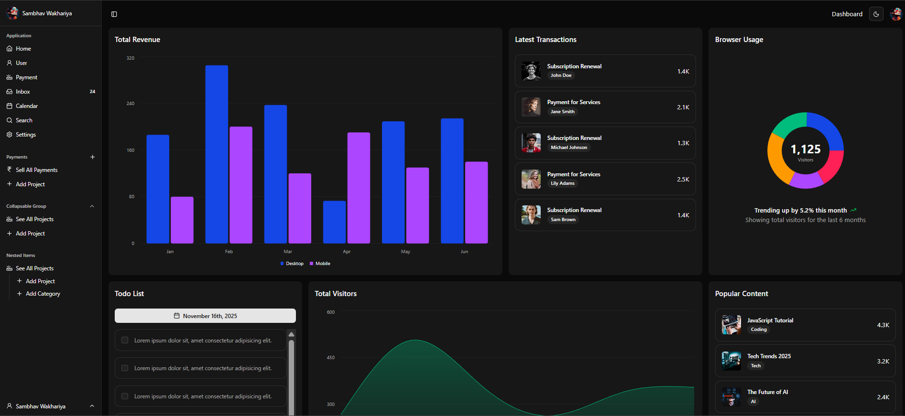

<div align="center">
  <br />
      
  <br />

  <div>
    
    
    
    
    
  </div>

<h3 align="center">⚡ Modern Admin Panel — Built with Next.js 16 + ShadCN</h3>
</div>

## 📋 Table of Contents

1. 🚀 [Introduction](#intro)
2. ⚙️ [Tech Stack](#stack)
3. 🧩 [Features](#features)
4. 🏗️ [Project Timeline](#timeline)
5. 🤸 [Quick Start](#start)
6. 📁 [Folder Structure](#structure)
7. 📌 [Future Improvements](#future)

---

## 🚀 <a name="intro">Introduction</a>

This project is a **fully modular, production-grade Admin Panel** built with the latest:

- **Next.js 16 App Router**
- **React 19**
- **ShadCN/UI components**
- **TanStack Table**
- **Tailwind CSS**
- **Charts, Forms, Sidebar, Dark Mode, and more**

Designed with **Scalability + Reusability** in mind — every component is isolated and can be reused in real SaaS dashboards.

---

## ⚙️ <a name="stack">Tech Stack</a>

| Tool | Usage |
|------|-------|
| **Next.js 16** | App Router, Server Components |
| **React 19** | Latest React features |
| **ShadCN/UI** | Headless + styled UI components |
| **Tailwind CSS** | Styling |
| **TypeScript** | Type safety |
| **TanStack Table** | Data table, sorting, selection |
| **Zod + React Hook Form** | Form validation |
| **Recharts** | Line, Bar, Pie, Area charts |

---

## 🧩 <a name="features">Features</a>

✔ Dark / Light mode toggle  
✔ Fully functional Sidebar (collapsible, nested, badges, actions)  
✔ Dashboard Cards  
✔ Progress Bar  
✔ Calendar widget  
✔ Hover cards  
✔ Breadcrumb Navigation  
✔ Charts (Line, Bar, Pie, Area)  
✔ User Profile Page + Card  
✔ Sheets / Popovers / Dropdown Menus  
✔ Todo list with custom scrollbar + checkbox  
✔ TanStack Table with:
   - Sorting  
   - Row Selection  
   - Pagination  
   - Custom Cells & Headers  
   - Action Column  
✔ Form validation using Zod  
✔ Grid layout based dashboard

---

## 🏗️ <a name="timeline">Development Timeline (Based on Commits)</a>

| Commit | Feature |
|--------|---------|
| `c8d1d48` | Initial Commit |
| `119e69a` | ShadCN Installed |
| `4553a08` | Next.js Dashboard Base UI |
| `f135485` | Navbar Added |
| `55d725d` | Dropdown Menu |
| `5a634aa` | Dark Mode Setup |
| `dc33e34` | Sidebar UI |
| `500e7cb` | Sidebar Collapse |
| `68100f7` | Sidebar Actions |
| `4292b0f` | Collapsible Sidebar Groups |
| `a418e8d` | Sidebar Badge |
| `24c1cba` | Nested Sidebar |
| `64c9e76` | Grid Layout |
| `c172e45` | Bar Chart |
| `5a1e174` | Area Chart |
| `94fc94c` | Pie Chart |
| `f1f652b` | Cards |
| `957415e` | Todo List Scrollbar & Checkbox |
| `29d3342` | Popover Component |
| `fa16413` | Calendar Component |
| `d3e3774` | User and Single User Page |
| `415ea20` | Breadcrumbs |
| `b49b1e4` | User Profile Page |
| `d5a696d` | Hover Card |
| `28669fe` | Progress Bar |
| `9306071` | Sheets Component |
| `039582a` | React Hook Form + Zod Validation |
| `ff17cf0` | User Profile Card |
| `edad160` | Line Chart |
| `233e89b` | TanStack Table UI Base |
| `fb7ce40` | Custom Table Headers + Cells |
| `902aaed` | Action Button in Table |
| `8745422` | Pagination |
| `809422e` | Sorting |
| `cf23aa3` | Row Selection |
| `8ad6b2d` | Routes Updated |
| `e359ce4` | Final UI Table Update ✔ |

---

## 🤸 <a name="start">Quick Start</a>

```bash
git clone https://github.com/Bloivating-Major/Next-Js-Dashboard.git
cd Next-Js-Dashboard
npm install
npm run dev
````

Visit 👉 **[http://localhost:3000](http://localhost:3000)**

---

## 📁 <a name="structure">Folder Structure</a>

```
src
 ├── app
 │   ├── dashboard
 │   ├── users
 │   ├── settings
 │   └── layout.tsx
 ├── components
 │   ├── ui (shadcn)
 │   ├── charts
 │   ├── table
 │   └── forms
 ├── hooks
 ├── lib
 └── types
```

---

## 📌 <a name="future">Future Improvements</a>

🔹 Authentication (NextAuth)
🔹 Role-based access
🔹 Realtime table updates
🔹 Connected database (Postgres / Prisma)
🔹 Export table data (CSV / XLSX)

---

## ⭐ Contribute

PRs and feedback welcome!

---
